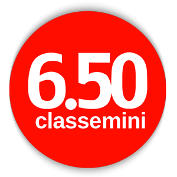
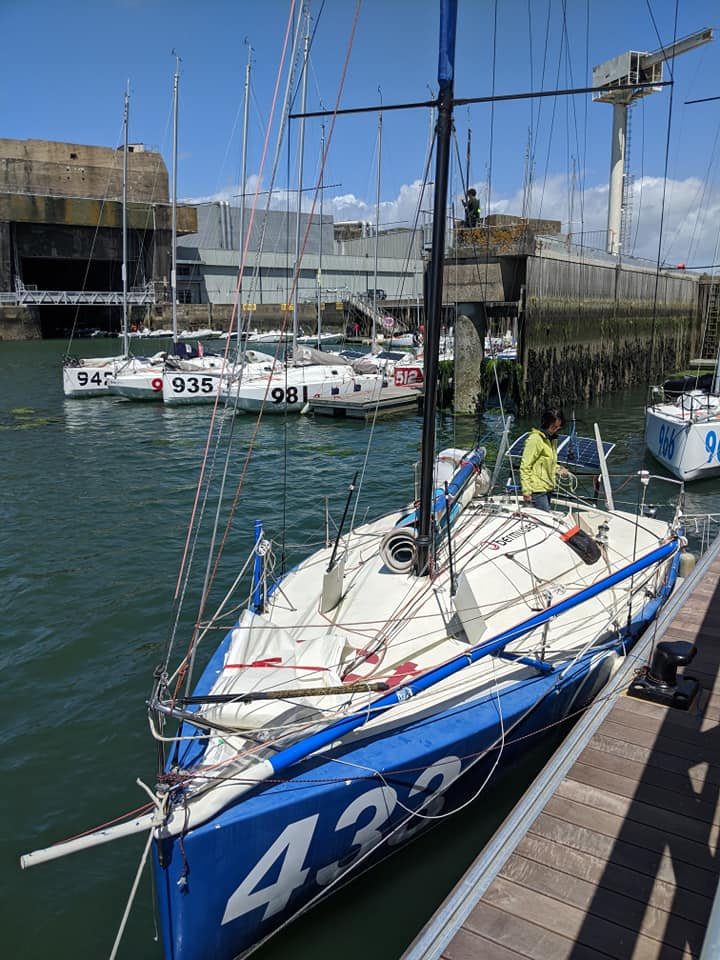
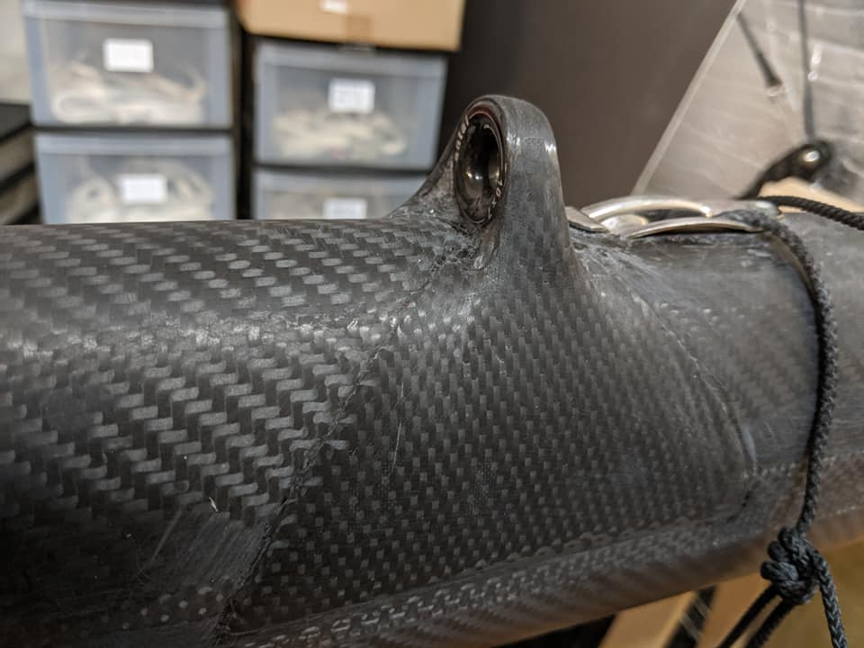
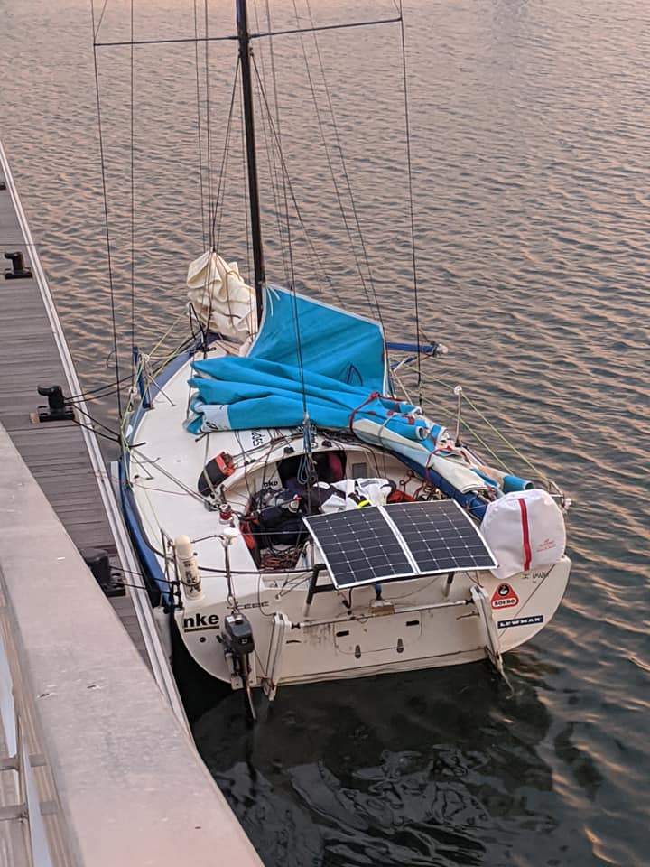
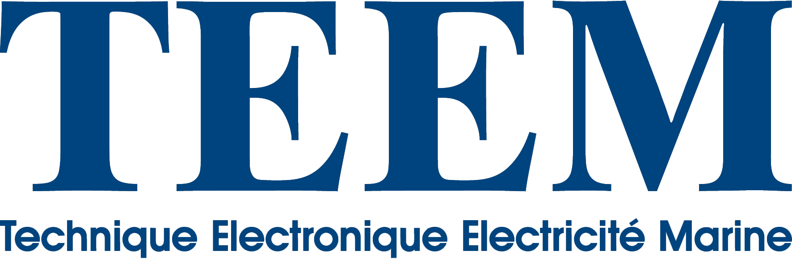
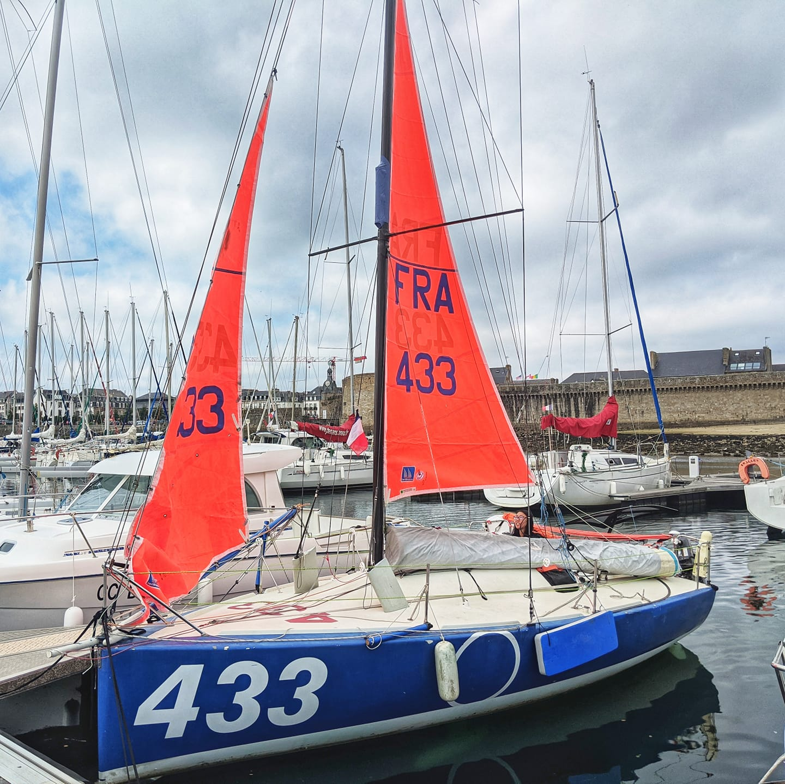

Il était temps
##############

:slug: il-était-temps_duo-concarneau
:date: 2020-09-20
:summary:
   Voici plus d'un an, que Rémy s'est lancé dans ce projet et toujours pas d'article ?
   Il était temps !

Voici plus d'un an, que Rémy s'est lancé dans ce projet et toujours pas d'article ?
Il était temps !

		  
La décision
===========

Au Salon du Nautic à Paris en Décembre 2018, je décide de me lancer
dans un projet Mini.

Ça fait un moment qu'on m'en parle, j'ai suivi Clarisse sur
l'Atlantique en 2016/2017 et j'ai bien envie de faire du Pogo 3 en
solitaire.

Je rencontre Clarisse au Nautic, juste avant l'annonce de son
partenariat IMOCA avec Banque Populaire et elle réponds à mes
questions et m'encourage à me lancer.

Le bateau
=========

Investir dans un Pogo 3 c'est 80000€ d'occasion et plus de 100000€
neuf. Autant dire, un sacré investissement, plus du double de ce que
je suis prêt à investir pour un premier bateau.

Je finis par tomber sous le charme de Amazig, le proto Manuard #433
sur lequel Corentin Douguet remporte la Mini Transat 2005.

Une belle machine qui a passé plus de 10 ans sous hangar et qui a
besoin d'un bon chantier.

Pablo, son récent propriétaire, accepte de me guider dans les
premières étapes du chantier et me permet de régler en 3 fois sur 8
mois.

Un beau chantier
================

On m'avait un peu prévenu, le proto c'est quand même plus de bricolage
que le série.

C'est aussi un peu exiguë car l'espace a l'intérieur est plutôt bien
encombré par le système de bascule de la quille et les réservoirs
d'eau de mer des ballasts.

Avant de pouvoir naviguer, il va falloir bricoler et avant de courrir
mettre le bateau à la jauge.

Il y a également un peu d'appréhension de ma part et je ne me vois pas
partir en mer avec un bateau qui pourrait tomber en panne ou pire
casser.

Chantier composite
==================

- La trappe de survie doit maintenant être sur charnière.
- On décide d'installer une chaise moteur pour les manœuvres de port
  en entraînement.
- La porte est également refaite ainsi qu'un support de panneau
  solaire et d'instruments éléctronique.

Chantier électricité
====================

Batteries HS, les batteries du bateau on rendu l'âme, je décide de
partir sur des batteries Lithium avec un circuit de charge via
panneaux solaires.

2 panneaux de 150W chacun ont été fixé à l'arrière sur un support. Un
troisième panneau volant (pour le mettre au soleil et non à l'ombre de
la GV.) peut se déployer depuis le cockpit. Ça permet de dépoter mais
uniquement lorsqu'il y a du soleil…

2 feux de secours branchés sur batteries sont maintenant demandés sur
le tableau arrière.

Chantier électronique
=====================

Sondeur et speedo ne fonctionne plus, les vieux écrans n'affichent pas
très bien les infos, il faut également remplacer le Mer Veille par un
AIS.

Chantier mât
============

Les bastaques sont inutilisables de même que les étais, les haubans et
les filliaires rouillés, sans compter le poids de ces câbles inox.

Le vernis du mât ne supporte pas non plus sa sortie à la lumière du
jour et les pontets de drisse de réas sont également à remplacer.

À peine remâté qu'une sortie plus tard, nous voilà de nouveau sur le
terre-plein pour de longs mois.

Le chantier du mât est finalement le plus long et le plus complexe car
de nombreuses pièces d'accastillages ont du être refaites, les
êtrémités de barres de flèches ont été usinées, les fixations au
niveau du pont transformée pour les haubans textiles (qui n'ont pas de
pas de vis).

Chantier sécu
=============

Évidemment tout le matériel sécu a expiré et est périmé, Charlotte et
Séverine feront un travail rigoureux pour vérifier et sélectionner
tout le matériel nécessaire.

Matelotage
==========

Les cordages ont également été un gros travail notamment sur le bout
dehors et les différentes drisses, écoutes, bastaques, haubans.

Remerciements
=============

        après un aller-retour musclé à Belle-Ile
  :align: center

Je tenais tout d'abord à remercier toutes les personnes qui
m'encouragent dans ce projet.

Séverine, Charlotte, Pablo, Nico, Aurélien, Alban, Robin, Renaud,
Hannah, Valentin, Murielle, Vincent, Sabine, Timothée et tous les
autres.

Je tenais plus précisément à remercier Kasspatou (notamment Nico, Arno
et Mado), Blew Stoub (notamment Vincent, Arnaud et Marie), la Sellor
(notamment Gildas et Yannick) et TEEM (notamment Aurélien et Carole)
qui ont fait un travail remarquable pour m'accompagner dans ces
chantiers, prenant parfois sur leurs week-ends, prettant du matériel,
un hangar, étant source de bonnes astuces et de bonnes idées afin de
remettre ce magnifique bateau en état de courrir à nouveau.

.. image:: images/kasspatou.jpg
  :width: 420
  :alt: Logo Kasspatou — Nicolas Meyer
  :target: https://nicolasmeyer.org/kasspatou-racing-solutions/

.. image:: images/blewstoub.png
  :width: 400
  :alt: Logo Blew Stoub — Vincent Le Roux
  :target: https://www.facebook.com/pages/category/Science--Technology---Engineering/Blew-Stoub-147329505937546/

La suite ?
==========

        de cape et son tourmentin oranges
  :align: center

Il y a bien des occasions de baisser les bras, mais quand on regarde
en arrière, les choses avancent malgré tout et on mesure le chemin
parcouru pour en arriver là.

Aujourd'hui nous sommes à la veille de la Duo Concarneau, nous avons
fait quelques entraînements avec Séverine, notamment un aller-retour
Lorient-Sein dans la pétole, le convoyage Lorient-Concarneau et un
aller-retour Lorient-Sauzon express.

Demain après midi, le bateau passe à la jauge, avec notamment le
fameux test de redressement.

Vu la météo, pas sur que la course soit maintenue mais la première
victoire c'est d'être sur la ligne et quel marathon pour en arriver là !
