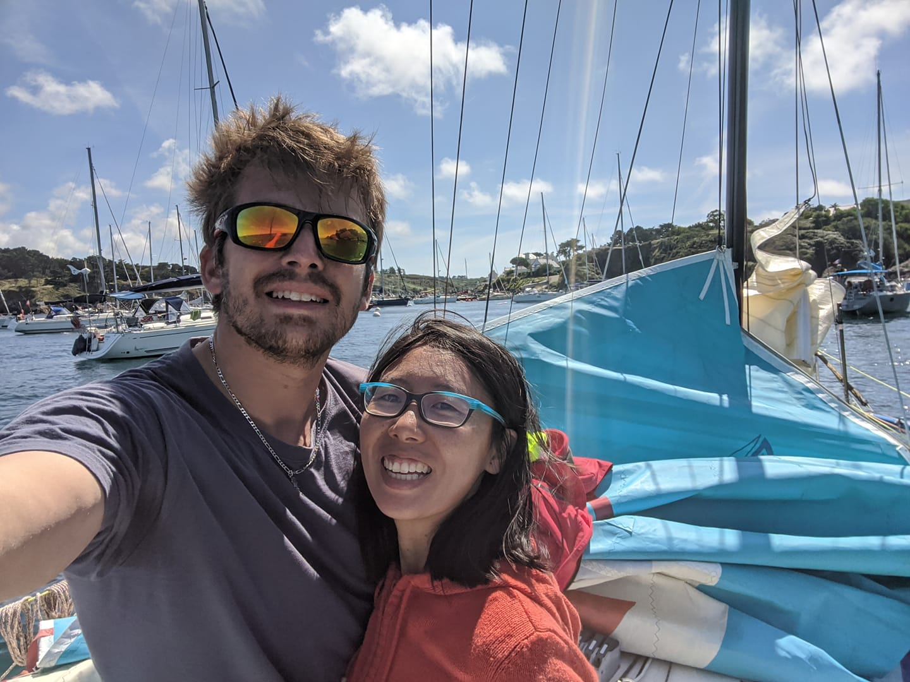
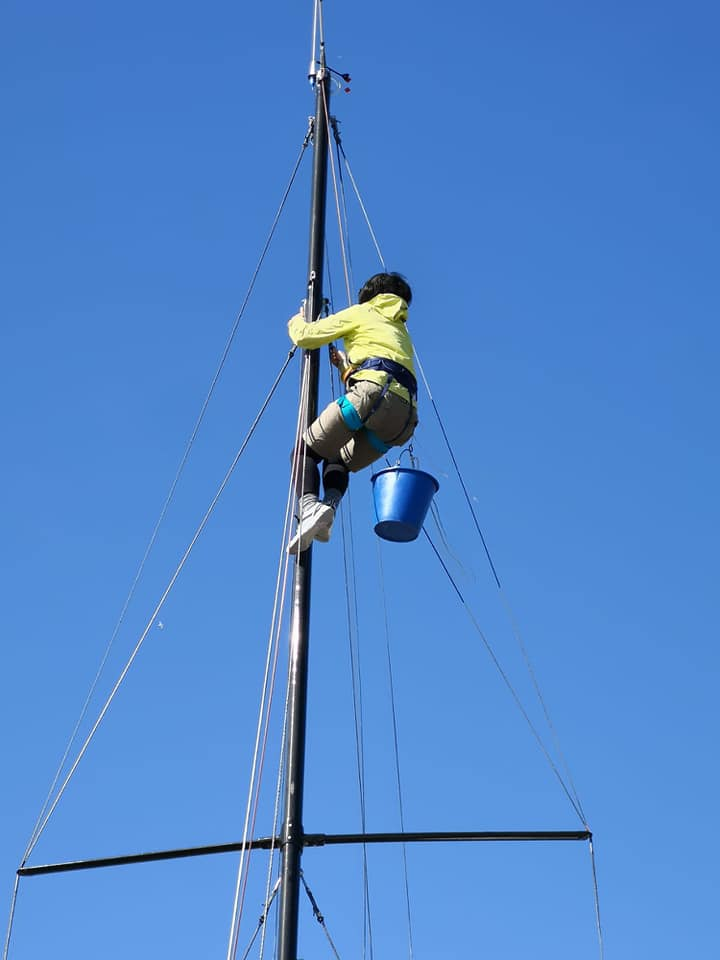

L'équipage
##########

:slug: equipage
:lang: fr
:url: equipage

Rémy Hubscher
=============

Rémy commence la voile croisière en arrivant en Bretagne en 2015. Avec
l'école de voile Les Glénans d'une part et via VogAvecMoi d'autre
part.

Très rapidement, devant son énergie, plusieurs skippers lui proposent
de faire la mini pour continuer d'en apprendre un maximum sur la voile.

Était-ce une bonne idée ? L'histoire nous le dira. Aujourd'hui le
bateau est là et après de nombreuses heures de bricolage, il s'apprête
à faire sa première course.

Séverine Beyer
==============

Séverine commence la voile en même temps que Rémy, un peu pour voir au
début, ça devient rapidement une réelle passion, navigatrice dans
l'âme, Séverine a un poste clé dans le projet mini.

Séverine est une partenaire redoutablement efficace à terre, en
entrainement mais également lors des courses en double.
